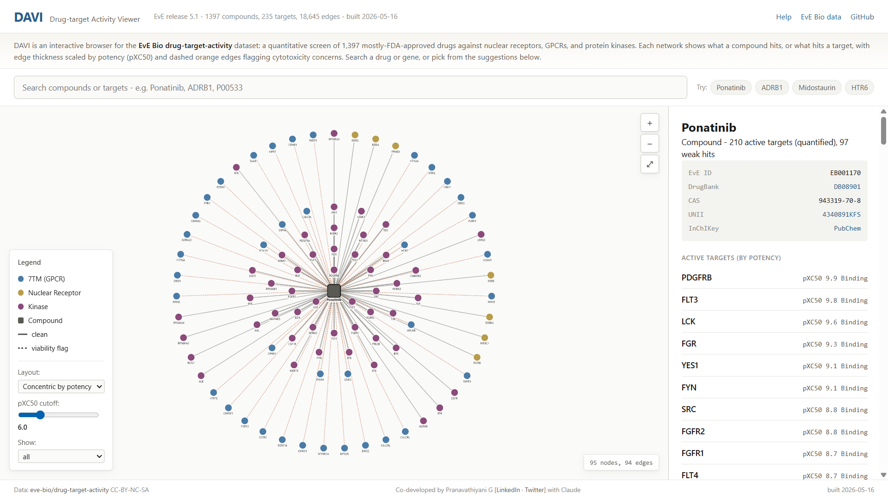

# DAVI - Drug-target Activity VIewer


**Drug-target Activity Viewer**

An interactive browser for the [EvE Bio drug-target-activity dataset](https://huggingface.co/datasets/eve-bio/drug-target-activity): a quantitative screen of 1,397 mostly-FDA-approved drugs against nuclear receptors, GPCRs, and protein kinases.

**Live site:** https://pranavathiyani.github.io/davi/

## What it does

DAVI renders ego networks centered on any compound or any target in the dataset. Edges are weighted by pXC50 (potency). Dashed orange edges flag compounds with cytotoxicity concerns. Three layout modes (concentric by potency, force-directed spring, circular) and live drag-spring physics let you explore polypharmacology and selectivity visually.

Search works on compound names, gene symbols, UniProt IDs, DrugBank IDs, CAS numbers. Side panel cross-links each compound/target to DrugBank, PubChem, UniProt, AlphaFold, and FDA UNII.

## Why

EvE Bio's dataset is unusually clean: full-matrix screening of an FDA-approved library against three target classes with quantified pXC50 from 11-point dose-response, explicit viability flags, mutant/wildtype kinase pairs, and dual-pathway (G-protein vs beta-arrestin2) GPCR coverage. It is updated bimonthly with new targets. DAVI exists because a parquet on Hugging Face is not the same as a tool you can hand to a pharmacologist.

This is an independent academic viewer. EvE Bio publishes their own data explorer; DAVI is complementary, focused on network-first exploration.

## Data snapshot

Current build uses EvE Bio releases 1.3 through 11 (the full bundled snapshot as of the build date shown in the footer). The dataset is refreshed bimonthly; DAVI regenerates by rerunning the build script.

- 1,397 compounds
- 235 targets (7TM GPCRs, nuclear receptors, kinases including mutant variants)
- 18,645 quantified active compound-target interactions
- 31,970 active-but-unquantified (weak) hits, surfaced in the side panel

## Running locally

Prerequisites: a recent Python with [polars](https://pola.rs/), and any static HTTP server.

```bash
# 1. Clone
git clone https://github.com/pranavathiyani/davi.git
cd davi

# 2. Download the EvE Bio parquet (not in repo - CC-BY-NC-SA licensed upstream)
mkdir -p data/raw
curl -L -o data/raw/train.parquet \
  https://huggingface.co/datasets/eve-bio/drug-target-activity/resolve/main/train.parquet

# 3. Build the JSONs
pip install polars
python scripts/build_jsons.py

# 4. Serve docs/ over HTTP
cd docs
python -m http.server 8000
# Open http://localhost:8000
```

The `docs/data/` JSONs in this repo are the built outputs of step 3 against the parquet snapshot listed in `docs/data/build_info.json`. Rerun `build_jsons.py` to refresh.

## Repository layout

```
davi/
├── scripts/
│   ├── inspect_schema.py    # one-shot schema inspection
│   ├── inspect_schema_2.py  # follow-up checks (multiplicity, hub stats)
│   └── build_jsons.py       # parquet -> six JSONs in docs/data/
├── docs/                    # GitHub Pages serves from here
│   ├── index.html
│   ├── css/style.css
│   ├── js/app.js
│   └── data/                # built JSON outputs (snapshot artifacts)
├── data/
│   └── raw/                 # gitignored; place train.parquet here
├── notes/
│   └── design.md            # design decisions and rationale
├── README.md
├── LICENSE                  # MIT for code; data inherits EvE Bio's CC-BY-NC-SA
└── .gitignore
```

## Tech stack

Plain HTML, CSS, JavaScript. No build step, no framework.

- [Cytoscape.js](https://js.cytoscape.org/) for network rendering
- [cytoscape-cola](https://github.com/cytoscape/cytoscape.js-cola) for the constraint-based spring layout
- [MiniSearch](https://lucaong.github.io/minisearch/) for client-side fuzzy autocomplete
- [polars](https://pola.rs/) for the Python build script

All client libraries load from CDN, so no bundling is needed.

## Citation

If you use DAVI in published work, cite both the data and the tool:

**Data:**
> EvE Bio, LLC (2026). drug-target-activity dataset. Hugging Face Datasets. https://huggingface.co/datasets/eve-bio/drug-target-activity. CC-BY-NC-SA 4.0.

**Tool:**
> Pranavathiyani G. (2026). DAVI: Drug-target Activity Viewer. https://github.com/pranavathiyani/davi

## Licensing

Source code: MIT (see [LICENSE](LICENSE)).

The JSON files under `docs/data/` are derived from EvE Bio's dataset and inherit its **CC-BY-NC-SA 4.0** license. Non-commercial use only for the data; commercial use of the data requires permission from EvE Bio. The source code itself is permissively licensed and can be reused freely.

## Credits

Co-developed by [Pranavathiyani Gnanasekar](https://linkedin.com/in/pranavathiyani) ([Twitter](https://twitter.com/pranavathiyani)) with Claude (Anthropic).

Underlying data: [EvE Bio](https://evebio.org).
